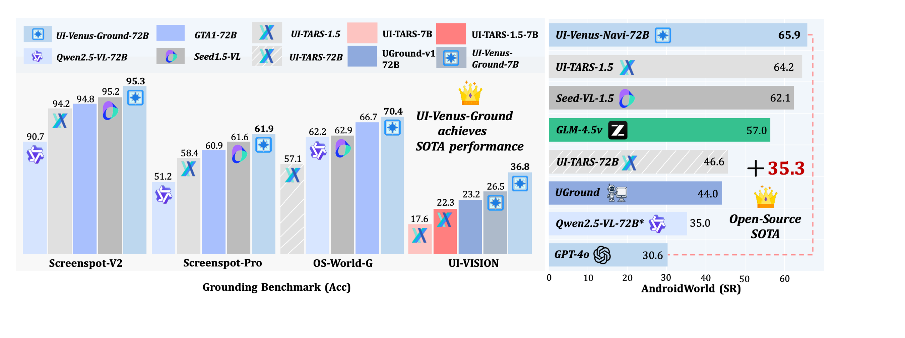

# 🌟 UI-Venus: Building High-Performance UI Agents with RFT


[](https://opensource.org/licenses/Apache-2.0)
[](http://arxiv.org/abs/2508.10833)
[](https://github.com/inclusionAI/UI-Venus)
[](https://huggingface.co/collections/inclusionAI/ui-venus-689f2fb01a4234cbce91c56a)


<p align="center">
  <em>UI-Venus leverages Reinforcement Fine-Tuning (RFT) to achieve state-of-the-art performance in GUI understanding and action prediction across mobile, desktop, and web interfaces.</em>
</p>

---

 <p align="center">
  📈 UI-Venus Benchmark Performance
</p>

<p align="center">
  
  <br>
</p>

> **Figure:** Performance of UI-Venus across multiple benchmark datasets. UI-Venus achieves **State-of-the-Art (SOTA)** results on key UI understanding and interaction benchmarks, including **ScreenSpot-Pro**, **ScreenSpot-v2**, **OS-World-G**, **UI-Vision**, and **Android World**. The results demonstrate its superior capability in visual grounding, UI navigation, cross-platform generalization, and complex task reasoning.


---
# Overview

* [Key Highlights](#key-highlights)
* [Installation](#installation)
* [Quick Start](#quick-start)
* [Evaluation](#evaluation)
* [Citation](#citation)


---


# ✨ Key Highlights

We introduce **UI-Venus**, a state-of-the-art UI agent that pushes the boundaries of visual grounding and interactive navigation. Below are the core contributions and innovations:

  ---

  ### 💡 Open-Source SOTA UI Agent with Full Toolchain
  We develop and open-source **UI-Venus** — a state-of-the-art UI agent trained on **350K high-quality, professionally annotated samples**.  
  In addition to model checkpoints (7B & 72B), we release:
  - 🔹 Full evaluation pipeline
  - 🔹 Inference scripts

  👉 [GitHub Repository](https://github.com/inclusionAI/UI-Venus) | [Hugging Face Model](https://huggingface.co/collections/inclusionAI/ui-venus-689f2fb01a4234cbce91c56a)

  ---

  ### 📏 Action-Level Reward Design for RL-Based Navigation
  Beyond grounding, we design **fine-grained, action-wise reward functions** for reinforcement learning in GUI navigation tasks.  
  Our approach achieves:
  - ✅ Competitive performance on **AndroidWorld**
  - ✅ Better credit assignment in long-horizon tasks
  - ✅ End-to-end learnable action prediction with policy gradients

  This marks a significant step toward **autonomous UI interaction** with precise feedback signals.

  ---

  ### 🧹 Comprehensive Study on UI Data Quality & Cleaning Strategy
  We conduct a **systematic analysis of UI interaction data quality**, identifying key challenges in real-world traces.  
  To improve training signal fidelity, we propose a **three-stage data refinement pipeline**:
  1. **Prompt Rewrite** – Clarify ambiguous user intentions
  2. **Trace Editing** – Fix incorrect or redundant actions
  3. **Trace Generation** – Synthesize missing steps via LLM-augmented modeling  

  📈 Result: RL & Higher-quality data → More robust and generalizable agents.


  ---

##  Installation

manually install the dependencies:

```bash
pip install -r requirements.txt
```

---
  


##  Quick Start

Use the shell scripts to launch the evaluation. The evaluation setup follows the same protocol as **ScreenSpot**, including data format, annotation structure, and metric calculation.

### Grounding
- **For 7B model:**
  ```bash 
  bash scripts/run_gd_7b.sh
  ```
  
- **For 72B model:**
  ```bash 
  bash scripts/run_gd_72b.sh
  ```

🔧 Configuration Required.
Please set the following paths in your script:

* `screenspot_imgs`: Folder containing your screenshots (e.g., Screenspot-pro/images)
* `screenspot_test`: Folder containing your all json files  (e.g., Screenspot-pro/annotations)
* `model_name_or_path`: Model checkpoint path (e.g., /root/ckpt/huggingface/)
* `log_path`: Output folders


### 📄 Data Format

We provide example templates for input and output formats:

- **Input Format (Grounding Annotations):**  
  `examples/grounding_meta_format.json` — Defines the standard structure of annotation files in `screenspot_test`.

- **Output Format (Model Predictions):**  
  `examples/grounding_result_format.json` — Shows the recommended format for model prediction results.

Please refer to these examples when preparing your data or parsing the evaluation outputs.

### Navigation
- **For 7B model:**
  ```bash 
  bash scripts/run_navi_7b.sh
  ```

- **For 72B model:**
  ```bash 
  bash scripts/run_navi_72b.sh
  ```
🔧 Configuration Required.
Please set the following paths in your script:
* `model_path`: Path to the model checkpoint (e.g., inclusionAI/UI-Venus-Navi-7B). 
* `input_file`: Input JSON file containing navigation tasks (str, default: examples/trace.json). Each entry must include:
  - task: The user instruction (string)
  - image_path: Screenshot filepath  
* `output_file`: Path to save the agent’s execution history (JSON format)
---

## Evaluation

###  Results on ScreenSpot-v2

| **Model**                | **Mobile Text** | **Mobile Icon** | **Desktop Text** | **Desktop Icon** | **Web Text** | **Web Icon** | **Avg.** |
|--------------------------|-----------------|-----------------|------------------|------------------|--------------|--------------|----------|
| uitars-1.5               | -               | -               | -                | -                | -            | -            | 94.2     |
| Seed-1.5-VL              | -               | -               | -                | -                | -            | -            | 95.2     |
| GPT-4o                   | 26.6            | 24.2            | 24.2             | 19.3             | 12.8         | 11.8         | 20.1     |
| Qwen2.5-VL-7B            | 97.6            | 87.2            | 90.2             | 74.2             | 93.2         | 81.3         | 88.8     |
| UI-TARS-7B               | 96.9            | 89.1            | 95.4             | 85.0             | 93.6         | 85.2         | 91.6     |
| UI-TARS-72B              | 94.8            | 86.3            | 91.2             | 87.9             | 91.5         | 87.7         | 90.3     |
| LPO                      | 97.9            | 82.9            | 95.9             | 86.4             | 95.6         | 84.2         | 90.5     |
| **UI-Venus-Ground-7B (Ours)**  | **99.0**        | **90.0**        | **97.0**         | **90.7**         | **96.2**     | **88.7**     | **94.1** |
| **UI-Venus-Ground-72B (Ours)**  | **99.7**        | **93.8**        | **95.9**         | **90.0**         | **96.2**     | **92.6**     | **95.3** |

---


### Results on ScreenSpot-Pro

Performance comparison of GUI agent models across six task categories on **ScreenSpot-Pro**.  
Scores are in percentage (%). `T` = Text, `I` = Icon.  
`*`: reproduced; `†`: trained from UI-TARS-1.5-7B.

| Model | CAD (T/I) | Dev (T/I) | Creative (T/I) | Scientific (T/I) | Office (T/I) | OS (T/I) | Avg T | Avg I | **Overall** | Type |
|-------|-----------|-----------|----------------|------------------|--------------|---------|--------|--------|------------|------|
| GPT-4o | 2.0 / 0.0 | 1.3 / 0.0 | 1.0 / 0.0 | 2.1 / 0.0 | 1.1 / 0.0 | 0.0 / 0.0 | 1.3 | 0.0 | 0.8 | Closed |
| Claude Computer Use | 14.5 / 3.7 | 22.0 / 3.9 | 25.9 / 3.4 | 33.9 / 15.8 | 30.1 / 16.3 | 11.0 / 4.5 | 23.4 | 7.1 | 17.1 | Closed |
| UI-TARS-1.5 | – / – | – / – | – / – | – / – | – / – | – / – | – | – | **61.6** | Closed |
| Seed1.5-VL | – / – | – / – | – / – | – / – | – / – | – / – | – | – | 60.9 | Closed |
| Qwen2.5-VL-7B\* | 16.8 / 1.6 | 46.8 / 4.1 | 35.9 / 7.7 | 49.3 / 7.3 | 52.5 / 20.8 | 37.4 / 6.7 | 38.9 | 7.1 | 26.8 | SFT |
| Qwen2.5-VL-72B* | 54.8 / 15.6 | 65.6 / 16.6 | 63.1 / 19.6 | 78.5 / 34.5 | 79.1 / 47.2 | 66.4 / 29.2 | 67.3 | 25.0 | 51.2 | SFT |
| UI-TARS-7B | 20.8 / 9.4 | 58.4 / 12.4 | 50.0 / 9.1 | 63.9 / 31.8 | 63.3 / 20.8 | 30.8 / 16.9 | 47.8 | 16.2 | 35.7 | SFT |
| UI-TARS-72B | 18.8 / 12.5 | 62.9 / 17.2 | 57.1 / 15.4 | 64.6 / 20.9 | 63.3 / 26.4 | 42.1 / 15.7 | 50.9 | 17.6 | 38.1 | SFT |
| Phi-Ground-7B | 26.9 / 17.2 | 70.8 / 16.7 | 56.6 / 13.3 | 58.0 / 29.1 | 76.4 / 44.0 | 55.1 / 25.8 | 56.4 | 21.8 | 43.2 | RL |
| UI-TARS-1.5-7B | – / – | – / – | – / – | – / – | – / – | – / – | – | – | 49.6 | RL |
| GTA1-7B† | 53.3 / 17.2 | 66.9 / 20.7 | 62.6 / 18.2 | 76.4 / 31.8 | 82.5 / 50.9 | 48.6 / 25.9 | 65.5 | 25.2 | 50.1 | RL |
| GTA1-72B | 56.9 / 28.1 | 79.9 / 33.1 | 73.2 / 20.3 | 81.9 / 38.2 | 85.3 / 49.1 | 73.8 / 39.1 | 74.5 | 32.5 | 58.4 | RL |
| **UI-Venus-Ground-7B** | 60.4 / 21.9 | 74.7 / 24.1 | 63.1 / 14.7 | 76.4 / 31.8 | 75.7 / 41.5 | 49.5 / 22.5 | 67.1 | 24.3 | **50.8** | Ours (RL) |
| **UI-Venus-Ground-72B** | 66.5 / 29.7 | 84.4 / 33.1 | 73.2 / 30.8 | 84.7 / 42.7 | 83.1 / 60.4 | 75.7 / 36.0 | 77.4 | 36.8 | **61.9** | Ours (RL) |

> 🔝 **Experimental results show that UI-Venus-Ground-72B achieves state-of-the-art performance on ScreenSpot-Pro with an average score of 61.9, while also setting new benchmarks on ScreenSpot-v2(95.3), OSWorld_G(70.4), AgentCPM(85), and UI-Vision(36.8), highlighting its effectiveness in complex visual grounding and action prediction tasks.**

### Results on AndroidWorld
This is the compressed package of validation trajectories for **AndroidWorld**, including execution logs and navigation paths.  
📥 Download: [UI-Venus-androidworld.zip](vis_androidworld/UI-Venus-androidworld.zip)

| Models | With Planner | A11y Tree | Screenshot | Success Rate (pass@1) |
|--------|--------------|-----------|------------|------------------------|
| **Closed-source Models** | | | | |
| GPT-4o| ❌ | ✅ | ❌ | 30.6 |
| ScaleTrack| ❌ | ✅ | ❌ | 44.0 |
| SeedVL-1.5 | ❌ | ✅ | ✅ | 62.1 |
| UI-TARS-1.5 | ❌ | ❌ | ✅ | 64.2 |
| **Open-source Models** | | | | |
| GUI-Critic-R1-7B | ❌ | ✅ | ✅ | 27.6 |
| Qwen2.5-VL-72B* | ❌ | ❌ | ✅ | 35.0 |
| UGround | ✅ | ❌ | ✅ | 44.0 |
| Aria-UI | ✅ | ❌ | ✅ | 44.8 |
| UI-TARS-72B | ❌ | ❌ | ✅ | 46.6 |
| GLM-4.5v | ❌ | ❌ | ✅ | 57.0 |
| **Ours** | | | | |
| UI-Venus-Navi-7B | ❌ | ❌ | ✅ | **49.1** |
| UI-Venus-Navi-72B | ❌ | ❌ | ✅ | **65.9** |

> **Table:** Performance comparison on **AndroidWorld** for end-to-end models. Our UI-Venus-Navi-72B achieves state-of-the-art performance, outperforming all baseline methods across different settings.


### Results on AndroidControl and GUI-Odyssey

| Models | AndroidControl-Low<br>Type Acc. | AndroidControl-Low<br>Step SR | AndroidControl-High<br>Type Acc. | AndroidControl-High<br>Step SR | GUI-Odyssey<br>Type Acc. | GUI-Odyssey<br>Step SR |
|--------|-------------------------------|-----------------------------|-------------------------------|-----------------------------|------------------------|----------------------|
| **Closed-source Models** | | | | | | |
| GPT-4o | 74.3 | 19.4 | 66.3 | 20.8 | 34.3 | 3.3 |
| **Open Source Models** | | | | | | |
| Qwen2.5-VL-7B | 94.1 | 85.0 | 75.1 | 62.9 | 59.5 | 46.3 |
| SeeClick | 93.0 | 75.0 | 82.9 | 59.1 | 71.0 | 53.9 |
| OS-Atlas-7B | 93.6 | 85.2 | 85.2 | 71.2 | 84.5 | 62.0 |
| Aguvis-7B| - | 80.5 | - | 61.5 | - | - |
| Aguvis-72B| - | 84.4 | - | 66.4 | - | - |
| OS-Genesis-7B | 90.7 | 74.2 | 66.2 | 44.5 | - | - |
| UI-TARS-7B| 98.0 | 90.8 | 83.7 | 72.5 | 94.6 | 87.0 |
| UI-TARS-72B| **98.1** | 91.3 | 85.2 | 74.7 | **95.4** | **88.6** |
| GUI-R1-7B| 85.2 | 66.5 | 71.6 | 51.7 | 65.5 | 38.8 |
| NaviMaster-7B | 85.6 | 69.9 | 72.9 | 54.0 | - | - |
| UI-AGILE-7B | 87.7 | 77.6 | 80.1 | 60.6 | - | - |
| AgentCPM-GUI | 94.4 | 90.2 | 77.7 | 69.2 | 90.0 | 75.0 |
| **Ours** | | | | | | |
| UI-Venus-Navi-7B | 97.1 | 92.4 | **86.5** | 76.1 | 87.3 | 71.5 |
| UI-Venus-Navi-72B | 96.7 | **92.9** | 85.9 | **77.2** | 87.2 | 72.4 |

> **Table:** Performance comparison on offline UI navigation datasets including AndroidControl and GUI-Odyssey. Note that models with * are reproduced.


# Citation
Please consider citing if you find our work useful:
```plain
@misc{gu2025uivenustechnicalreportbuilding,
      title={UI-Venus Technical Report: Building High-performance UI Agents with RFT}, 
      author={Zhangxuan Gu and Zhengwen Zeng and Zhenyu Xu and Xingran Zhou and Shuheng Shen and Yunfei Liu and Beitong Zhou and Changhua Meng and Tianyu Xia and Weizhi Chen and Yue Wen and Jingya Dou and Fei Tang and Jinzhen Lin and Yulin Liu and Zhenlin Guo and Yichen Gong and Heng Jia and Changlong Gao and Yuan Guo and Yong Deng and Zhenyu Guo and Liang Chen and Weiqiang Wang},
      year={2025},
      eprint={2508.10833},
      archivePrefix={arXiv},
      primaryClass={cs.CV},
      url={https://arxiv.org/abs/2508.10833}, 
}
```
